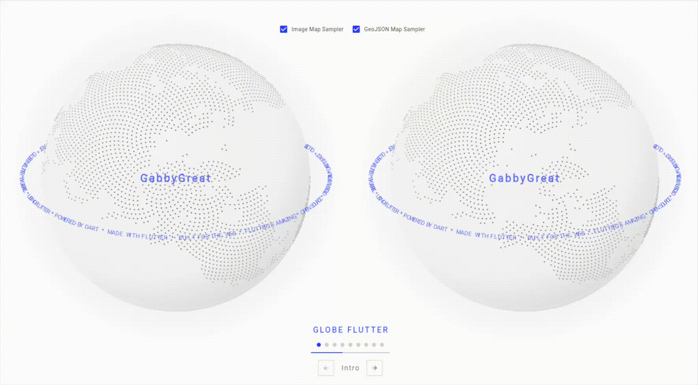

# cobe_flutter

A Flutter package that recreates the COBE globe with dotted land masses,
markers, arcs, and overlay projections.



Visual inspiration and interaction reference: [COBE IP demo](https://cobe.vercel.app/ip).

## Features

- `CobeGlobe`: the interactive globe widget
- `CobeController`: state updates via `update(...)` and `replace(...)`
- `CobeOptions`: rendering configuration
- `CobeMarker` and `CobeArc`: globe entities
- image and GeoJSON-based map sampling

## Installation

```yaml
dependencies:
  cobe_flutter: ^0.1.0
```

## Usage

```dart
import 'package:cobe_flutter/cobe_flutter.dart';
import 'package:flutter/material.dart';

class GlobeDemo extends StatefulWidget {
  const GlobeDemo({super.key});

  @override
  State<GlobeDemo> createState() => _GlobeDemoState();
}

class _GlobeDemoState extends State<GlobeDemo> {
  late final CobeController controller = CobeController(
    const CobeOptions(
      width: 640,
      height: 640,
      phi: 0,
      theta: 0.25,
      dark: 0,
      diffuse: 1.2,
      mapSamples: 9000,
      mapBrightness: 6,
      baseColor: Color(0xFFEAF1FF),
      markerColor: Color(0xFF2C6BFF),
      glowColor: Color(0xFF8CB6FF),
      arcColor: Color(0xFF446BFF),
      markers: <CobeMarker>[
        CobeMarker(
          id: 'lagos',
          location: CobeLocation(6.5244, 3.3792),
          size: 0.06,
        ),
      ],
    ),
  );

  @override
  void dispose() {
    controller.dispose();
    super.dispose();
  }

  @override
  Widget build(BuildContext context) {
    return CobeGlobe(
      controller: controller,
      autoRotate: true,
      autoRotateSpeed: 0.18,
      draggable: true,
    );
  }
}
```

## Demo

There is a fuller showcase app in [`demo/`](demo/) covering markers, arcs,
overlays, and alternate map samplers.
